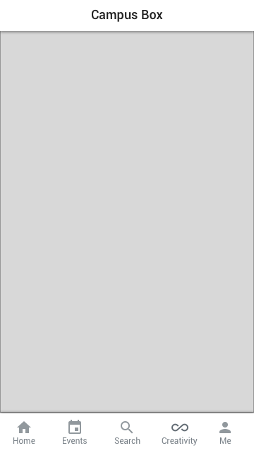
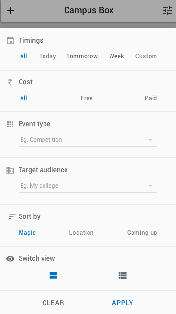

# Artboards

This is an autogenerated file showing all the artboards. Do not edit it directly.

## A

## Action bar going

## Action bar interested

## Action bar normal

## B Bottom sheet

## B

## Bottom Sheet

## Event condensed

## Settings B

## Settings

## Top bar

## ic_condense

## ic_drop_down

## ic_expand

## ic_filter

## ic_going

## ic_inr

## ic_interested

## ic_place

## ic_sort

